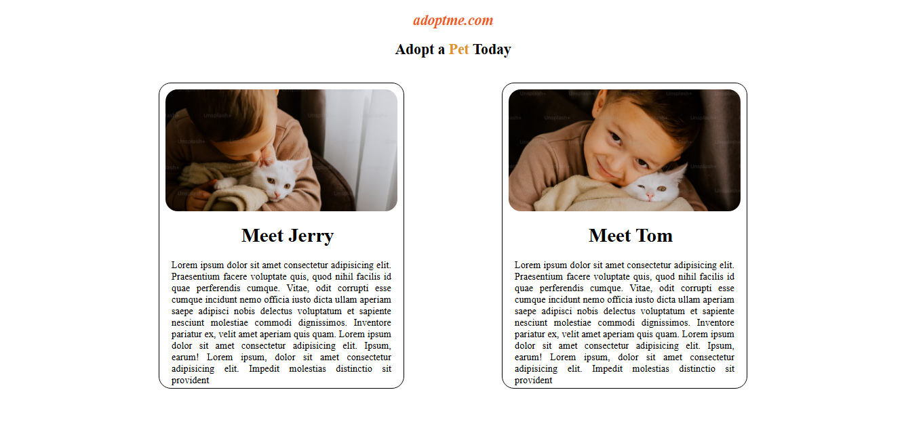

# 🐾 Pet Adoption Website

This is a simple and responsive **Pet Adoption Website** created using only **HTML** and **CSS**. It provides users with information about pets available for adoption and encourages them to give a forever home to pets in need.

## 📷 Screenshots
> 

## 🔧 Technologies Used

- HTML5
- CSS3

## 🌟 Features

- Beautiful home page with banner
- List of pets available for adoption
- Responsive design

## 🚀 Future Improvements

We plan to enhance this website in the future by:

- Adding JavaScript for interactive features (like filter pets by type, search bar, and animations)
- Adding backend support using Node.js and MongoDB to store pet data
- Adopting cards and modals for pet profiles
- Improving UI/UX with CSS animations and transitions
- Adding a form to apply for pet adoption
- Host on the Netlify for live demo


## 🛠️ Project Setup

Just open `index.html` in any web browser to view the website.

## 📁 Folder Structure

```
Pet-Adoption-Website/
│
├── index.html
├── style.css
├── assets/
│   └── (pet photos here)
└── README.md
```

## 👨‍💻 Author

Made with ❤️ by [Mohd Khubaib](https://github.com/Mohdkhubaib01)
📧 Email: mkhubaib543@gmail.com  

## 📄 License

This project is for educational purposes only.

